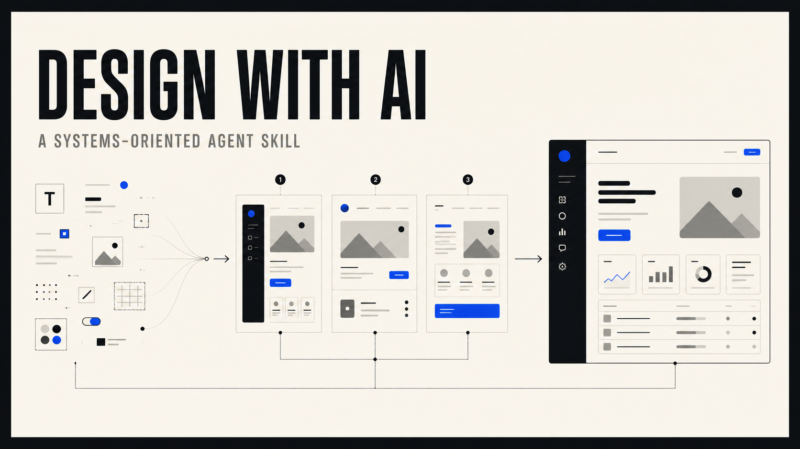
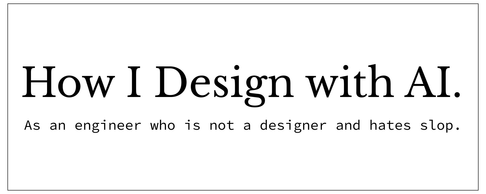

# Design with AI



Design with AI is an agent skill for product interface work. Use it to design a new flow, review an existing one, or clean up AI-generated UI that has become cluttered or generic.

[Aman Maqsood](https://github.com/amanmaqsood) built it for Codex and Claude Code.

## Install

### Codex

```bash
codex plugin marketplace add amanmaqsood/design-with-ai && codex plugin add design-with-ai@amanmaqsood-design
```

After installing, invoke it with `$design-with-ai`:

```text
$design-with-ai critique this checkout flow and recommend a coherent redesign
```

### Claude Code

```bash
claude plugin marketplace add amanmaqsood/design-with-ai && claude plugin install design-with-ai@amanmaqsood-design
```

After installing, invoke the plugin skill with:

```text
/design-with-ai:design-with-ai refine this dashboard without adding more UI
```

Run `/reload-plugins` if installing inside an active Claude Code session.

## What it does

Give the skill a product brief, screenshot, prototype, or existing implementation. It works in three modes:

- Design a new interface from product constraints.
- Critique an existing screen, flow, prototype, or implementation.
- Refine a direction without piling up local patches and unnecessary UI.

During a design pass, the skill maps product constraints, compares different directions, removes UI that does not earn its place, and checks realistic states in a working preview. It also looks for useful patterns in existing products and favors shared components over one-off elements.

The skill does not add runtime dependencies, MCP servers, telemetry, or network calls. It can only use the permissions and tools provided by Codex or Claude Code.

## Repository structure

```text
.agents/plugins/marketplace.json             Codex marketplace
.claude-plugin/marketplace.json              Claude Code marketplace
plugins/design-with-ai/.codex-plugin/        Codex manifest
plugins/design-with-ai/.claude-plugin/       Claude Code manifest
plugins/design-with-ai/skills/design-with-ai Shared Agent Skill
```

## Acknowledgments



Matt Dailey's *How I Design with AI* informed the first version of this skill. The post covers whole-system constraints, subtraction, low-cost iteration, components, previews, precedents, and learned taste. Its constraint-first approach also draws on Christopher Alexander's *Notes on the Synthesis of Form*.

Aman Maqsood wrote and maintains this repository. Matt Dailey, Christopher Alexander's estate, Anthropic, and OpenAI are not affiliated with it and do not endorse it.

## License

[MIT](LICENSE)
